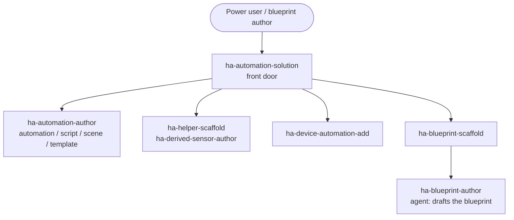

# Automationen und Blueprints erstellen (YAML)

Automationslogik und teilbare Blueprints für Home Assistant — von einer einzelnen Automation, die auf einen Trigger reagiert, bis zum fertig verpackten, wiederverwendbaren Blueprint, den andere installieren und über die Oberfläche konfigurieren.

## Anwendungsfälle

- Du willst eine **Automation** in YAML schreiben: einen Trigger, ein paar Bedingungen und eine Aktionsfolge — ein Bewegungslicht mit Timeout, eine Benachrichtigung, wenn eine Tür zu lange offen bleibt, oder eine nächtliche Routine, die die Alarmanlage scharf schaltet und die Lichter dimmt.
- Du willst wiederverwendbare **Skripte, Szenen oder Template-Entitäten** — ein Skript, das Du aus mehreren Automationen aufrufst, eine „Filmabend“-Szene oder einen Template-Sensor/-Binärsensor, dessen Zustand sich aus anderen Entitäten ableitet.
- Du brauchst einen **stateful Helper**, der einen Wert hält, den die Automation liest oder schreibt: ein `input_boolean`-Flag, einen `input_number`-Schwellwert, einen `timer`, einen `counter` oder ein `input_datetime`.
- Du willst einen **abgeleiteten oder statistischen Sensor**: einen Wert, der aus anderen Sensoren berechnet wird, ein `min`/`max`/`mean` über eine Gruppe oder eine Langzeit-Statistik (Energie-Summe, Tagesdurchschnitt) statt eines Rohwerts.
- Du willst eine funktionierende Automation als teilbaren **Blueprint** verpacken — mit Inputs, Selektoren und sinnvollen Defaults — damit andere sie importieren und über die Oberfläche konfigurieren können, ohne YAML anzufassen.

## Zielgruppen

- **Power-User, die Automationslogik in YAML schreiben.** Du bist im Editor zu Hause und willst die Trigger-/Bedingungs-/Aktions-Struktur, `choose`/`if-then`-Verzweigungen und Templating idiomatisch statt aus Forenbeiträgen zusammenkopiert. Dieser Anwendungsfall liefert Dir die Automations-, Skript-, Szenen- und Template-Artefakte, verdrahtet mit den richtigen Triggern und Bedingungen.
- **Blueprint-Autoren, die wiederverwendbare Automationen verpacken.** Du hast eine funktionierende Automation und willst sie anderen als Blueprint mit typisierten Inputs und Selektoren übergeben. `ha-blueprint-scaffold` legt die Struktur an und übergibt den Entwurf an den Agenten `ha-blueprint-author` für das Input- und Selektor-Design.
- **Nutzer, die abgeleitete Sensoren und Helper bauen.** Du willst einen berechneten Wert oder ein stateful Flag, um darauf Automationen aufzubauen — einen Schwellwert, einen Timer, einen Template-Binärsensor oder ein statistisches Aggregat. `ha-helper-scaffold` und `ha-derived-sensor-author` erzeugen diese als vollwertige, wohlgeformte Artefakte.

## Zusammenspiel von Skills und Agents

Die Front-Door `ha-automation-solution` plant die Arbeit und verteilt sie an fokussierte Skills und Agents; jeder fokussierte Skill besitzt genau ein Artefakt und seine eigene Spec-Konformität.

Beschreibe die Automation, die Du willst, und `ha-automation-solution` zerlegt sie in die benötigten Artefakte und verteilt sie einzeln. `ha-automation-author` schreibt die Automation, das Skript, die Szene oder die Template-Entität; `ha-helper-scaffold` und `ha-derived-sensor-author` ergänzen die Helper und abgeleiteten Sensoren, die sie liest; `ha-device-automation-add` verdrahtet Trigger und Aktionen auf Geräteebene. Ist das Ziel ein teilbarer Blueprint, legt `ha-blueprint-scaffold` die Struktur an und übergibt den Entwurf an den Agenten `ha-blueprint-author`. Braucht eine Automation einen Service oder eine Entität, die keine Integration bereitstellt, ist die natürliche Übergabe zu [Eine Custom Integration bauen (Python)](custom-integration.md).

## Eingesetzte Skills und Agents

- **Front-Door:** `ha-automation-solution`
- **Bausteine:** `ha-automation-author` (Automation / Skript / Szene / Template-Entität / Command-Artefakte), `ha-helper-scaffold` (stateful Helper), `ha-derived-sensor-author` (abgeleitete / statistische Sensoren), `ha-device-automation-add` (Geräte-Automationen), `ha-blueprint-scaffold` (übergibt den Entwurf an den Agenten `ha-blueprint-author`)
- **Verwandte Anwendungsfälle:** [Eine Custom Integration bauen (Python)](custom-integration.md)

Den vollständigen Katalog findest Du unter [Skills](../skills/index.md) und [Agents](../agents/index.md).

## Specs

- `spec/ha-automation/*` (Usage-Korpus)
- `spec/ha/blueprint-patterns`
