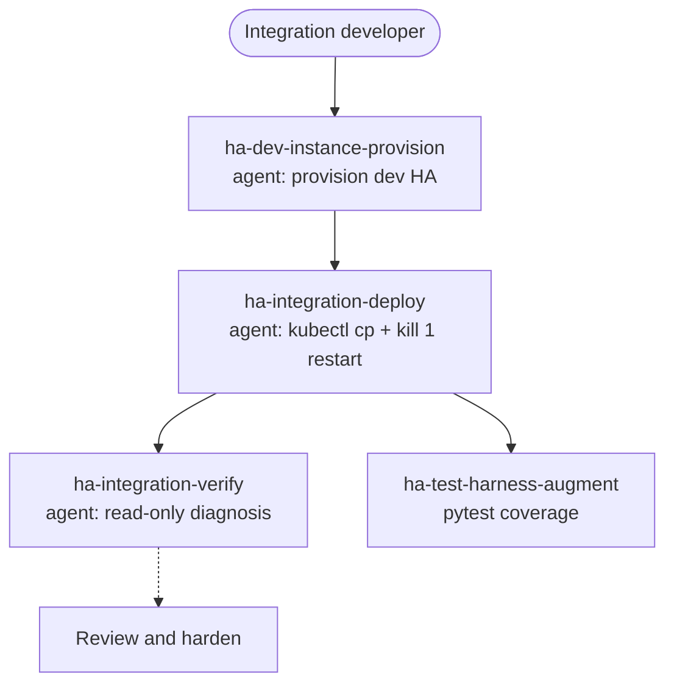

# Auf einer Dev-HA ausführen und testen

Deploye, inspiziere und teste eine Integration auf einer wegwerfbaren Home-Assistant-Instanz in einem lokalen Kubernetes-Cluster (Kind) — getrennt von der Produktion, damit ein kaputter Build nie Dein echtes Setup berührt.

## Anwendungsfälle

- Du hast gerade eine Integration gescaffoldet und willst sie **in einer echten Home Assistant laden sehen**, bevor Du eine weitere Zeile schreibst: Provisioniere eine Wegwerf-HA in Kind, deploye Dein `custom_components/<domain>/` hinein und beobachte, wie der Config-Flow auftaucht.
- Du hast einen Coordinator oder eine Entity geändert und willst eine **schnelle Edit-Deploy-Check-Schleife**: Schiebe die neuen Dateien mit `kubectl cp` in den laufenden Pod, starte HA an Ort und Stelle mit `kill 1` neu (lösche nie den Pod) und lies das Startup-Log — ganz ohne ein Image neu zu bauen.
- Etwas verhält sich falsch und Du brauchst eine **Read-only-Diagnose**: Inspiziere Logs, Entity-States und Config-Entry-Status des Pods, um herauszufinden, warum das Setup fehlschlug oder eine Entity `unavailable` wurde — ohne die Instanz zu verändern.
- Du **validierst einen Build vor einem PR** und willst eine Clean-Room-Instanz, die zu einer bekannten HA-Version passt, damit „läuft auf meiner Maschine“ heißt: „läuft auf einer Wegwerf-HA, die niemand sonst angefasst hat“.
- Du willst **pytest-Coverage für die sekundären Codepfade** — Reauth, Fehlerbehandlung, fehlgeschlagene Coordinator-Refreshes — die ein manuelles Durchklicken in der UI nie erreicht.

## Zielgruppen

- **Integrationsentwickler, die eine wegwerfbare HA zum Iterieren wollen.** Du willst weder Deine Produktivinstanz riskieren noch eine lokale HA-Installation von Hand pflegen. Dieser Anwendungsfall gibt Dir eine provisionier- und wegwerfbare Dev-HA in Kind und eine In-Place-Deploy-Schleife, die Dutzende Iterationen am Tag übersteht.
- **Contributor, die einen Build vor einem PR validieren.** Du musst beweisen, dass die Integration auf einer sauberen, bekannten HA-Version tatsächlich lädt und sich korrekt verhält. Die Provision- und Deploy-Agents geben Dir diese Clean-Room-Instanz; der Verify-Agent bestätigt, dass sie korrekt hochgekommen ist.
- **Entwickler, die pytest-Coverage lokal fahren.** Du willst die sekundären Codepfade durch Tests abgedeckt haben, nicht nur den Happy Path, den Du durchgeklickt hast. `ha-test-harness-augment` erweitert das pytest-Harness, um diese Zweige zu erreichen.

## Zusammenspiel von Skills und Agents

Dieser Anwendungsfall hat keine `*-solution`-Front-Door — er ist ein kleiner Cluster aus Agents plus einem Skill, verkettet als provision → deploy → verify, mit einem parallelen Schritt für Test-Coverage.

`ha-dev-instance-provision` zieht die wegwerfbare HA in Kind hoch (oder reißt sie ab); `ha-integration-deploy` rollt Deine Integration mit `kubectl cp` und einem In-Place-`kill 1`-Restart in den laufenden Pod — ohne den Pod je zu löschen; `ha-integration-verify` macht anschließend eine Read-only-Diagnose von Logs, States und Config-Entry-Status. Parallel wächst `ha-test-harness-augment` das pytest-Harness so, dass es die Zweige abdeckt, die die UI nicht erreicht. Was Du hier deployst, stammt aus [Eine Custom Integration bauen (Python)](custom-integration.md); sobald es sauber läuft, ist das nächste natürliche Gate [Review und Härtung vor dem Release](review-hardening.md).

## Eingesetzte Skills und Agents

- **Bausteine:** `ha-dev-instance-provision` (Agent: Dev-HA provisionieren / abreißen), `ha-integration-deploy` (Agent: Rollout via `kubectl cp`, `kill 1`-Restart — nie den Pod löschen), `ha-integration-verify` (Agent: Read-only-Pod-Diagnose); `ha-test-harness-augment` (Skill: pytest-Coverage für sekundäre Codepfade)
- **Verwandte Anwendungsfälle:** [Eine Custom Integration bauen (Python)](custom-integration.md), [Review und Härtung vor dem Release](review-hardening.md)

Den vollständigen Katalog findest Du unter [Skills](../skills/index.md) und [Agents](../agents/index.md).

## Specs

- `spec/ha/dev-environment`
- `spec/ha/dev-instance-provisioning`
- `spec/ha/test-harness`
