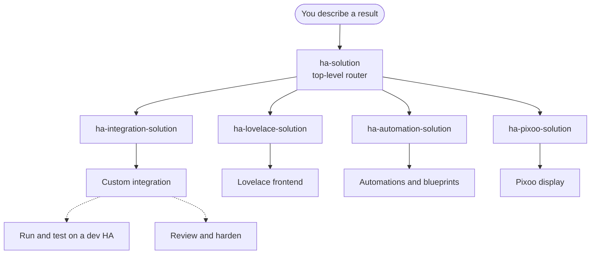

# Anwendungsfälle

Dieses Plugin bündelt Skills, Agents und Specs entlang von sechs Anwendungsfällen. Jeder **Domain**-Fall hat eine **Front-Door-Skill** (`*-solution`) — den Einstiegspunkt, der das gewünschte Ergebnis in die minimale Menge an Artefakten übersetzt und die fokussierten Skills aufruft. Du musst nicht selbst wissen, welche Skill welches Artefakt erzeugt.

Über den Domain-Front-Doors steht **`ha-solution`**, der Top-Level-Router. Beschreibe ein beliebiges Home-Assistant-Ergebnis: Er ordnet die Anfrage einer oder mehreren Domänen zu und leitet jeden Teil an die zuständige `*-solution` weiter. Bei echt domänenübergreifender Arbeit — etwa eine Custom Card plus die dahinterliegende Integration plus eine Automation — zerlegt er sie in Abhängigkeitsreihenfolge und hält die geteilten Identitäten (Domain, Entity-IDs, Card-Tags, Command-Typen) über die Grenzen hinweg konsistent. Greif direkt zu einer einzelnen Domain-Front-Door, wenn Du schon weißt, dass die Anfrage in genau einer Domäne liegt.

!!! info "Front-Door vs. fokussierte Skills"
    Die `*-solution`-Skills **erzeugen selbst nichts** — sie planen (mit Freigabe-Gate) und delegieren. Die fokussierten Skills besitzen je ein Artefakt und ihre eigene Spec-Konformität. Du kannst eine fokussierte Skill auch direkt nutzen, wenn der Bedarf eindeutig ist.

## Die sechs Anwendungsfälle

- [Eine Custom Integration bauen (Python)](custom-integration.md) — eine vollständige Integration unter `custom_components/<domain>/`, über HACS installierbar, vom Skelett bis zu fortgeschrittenen Plattform-Features.
- [Ein Lovelace-Frontend bauen (TypeScript / JavaScript)](lovelace-frontend.md) — eigene Cards, Editoren, Features, Panels und die Python-Backends, die sie versorgen.
- [Automationen und Blueprints erstellen (YAML)](automations-blueprints.md) — Automations-Logik, Helper, abgeleitete Sensoren und teilbare Blueprints.
- [Ein Divoom-Pixoo-Display bespielen](pixoo-display.md) — Info-Seiten, Pixel-Art und Animation auf der 64×64-LED-Matrix des Pixoo 64.
- [Auf einer Dev-HA ausführen und testen](dev-testing.md) — Deployen, Inspizieren und Testen auf einer Wegwerf-HA in einem lokalen Kubernetes-(Kind-)Cluster.
- [Review und Härtung vor dem Release](review-hardening.md) — Quality-Scale- und Sicherheits-Checks vor einem PR oder Release.

Den vollständigen, automatisch generierten Katalog — mit einer Beschreibung jeder Skill und jedes Agents — findest Du unter [Skills](../skills/index.md) und [Agents](../agents/index.md).

## Wie das zusammenspielt

- **Skills und Agents** sind die ausführenden Bausteine — Skills laufen interaktiv im Gespräch, Agents autonom mit strukturiertem Bericht.
- **Specs** unter `spec/` sind die Quelle der Wahrheit: `spec/ha/*` für HA-interne Verträge (gegen die offizielle HA-Doku verifiziert), `spec/claude/*` für die Skills und Agents selbst. Jede Skill und jeder Agent ist an ihre bzw. seine Spec gebunden.
- **`*-solution`-Front-Doors** sind der empfohlene Einstiegspunkt pro Domain-Anwendungsfall, sobald mehr als ein Artefakt nötig ist.

## Noch nicht abgedeckt

ESPHome-Custom-Components und Home-Assistant-Add-ons (Docker / s6) sind vorgesehene Anwendungsfälle, aber das Plugin liefert dafür noch **keine** Skills. Die Erwähnung von ESPHome / Add-ons im Tagline beschreibt die Roadmap, nicht den aktuellen Stand.
