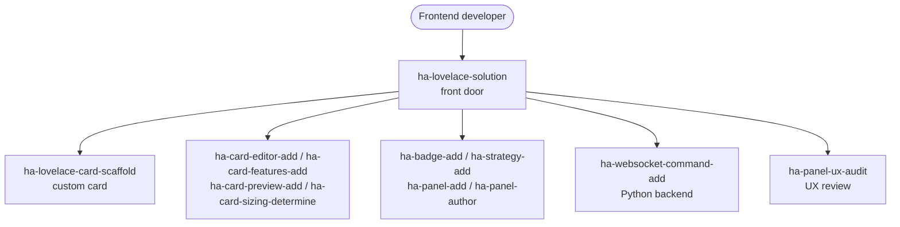

# Ein Lovelace-Frontend bauen (TypeScript / JavaScript)

Ein individuelles Frontend für Home-Assistant-Dashboards — Cards, visuelle Editoren, Tile-Features, Badges, Dashboard-Strategien und ganzseitige Panels, zusammen mit den Python-WebSocket-Backends, die sie mit Daten versorgen.

## Anwendungsfälle

- Du willst eine **eigene Lovelace-Card** bauen — ein `LitElement`-Web-Component, das als Custom Element registriert ist und Entity-Zustände so darstellt, wie es die eingebauten Cards nicht tun.
- Du willst einer Card einen **visuellen Konfigurations-Editor** geben, damit Nutzer sie in der Dashboard-UI verdrahten, statt YAML von Hand zu bearbeiten — dazu eine **Vorschau** und die korrekte **Card-Größe** im Masonry-Grid.
- Du willst einer Card **Tile-Features** hinzufügen, ein **Badge** für kompakten Status oder eine **Dashboard-Strategie**, die Views und Cards programmatisch aus der Entity-Registry erzeugt.
- Du willst ein **eigenes Panel** — ein ganzseitiges Frontend an eigener Sidebar-Route — erstellen, ihm eine Config-View geben und die UX prüfen lassen.
- Du willst eine Card oder ein Panel mit einem **Python-WebSocket-Backend** koppeln: ein registriertes `websocket_api`-Kommando, das die Daten streamt oder ausliefert, die das Frontend abonniert.

## Zielgruppen

- **TypeScript-/JavaScript-Frontend-Entwickler**, die maßgeschneiderte Lovelace-Cards als Web-Components bauen und Scaffold, Editor, Features und Sizing gemäß den HA-Contracts erledigt haben wollen.
- **Dashboard-Bauer**, denen die eingebauten Cards nicht mehr reichen und die eigene Cards, Badges, Strategien und Panels für ihr Setup brauchen.
- **Full-Stack-Integration-Entwickler**, die ein Frontend-Artefakt mit einem Python-WebSocket-Kommando koppeln, damit die Card genau die benötigte Backend-Datenform bekommt.

## Zusammenspiel von Skills und Agents

Die Front-Door `ha-lovelace-solution` plant das Frontend und delegiert an fokussierte Skills; jeder fokussierte Skill besitzt genau ein Artefakt und seine eigene Spec-Konformität.

Die Front-Door entscheidet, welche Artefakte eine Anfrage braucht, und leitet jedes an seinen Besitzer weiter: `ha-lovelace-card-scaffold` für das Card-Grundgerüst, die Editor-/Features-/Preview-/Sizing-Skills für die Card-Anreicherung, die Badge-/Strategy-/Panel-Skills für die übrigen Frontend-Oberflächen und `ha-websocket-command-add`, wenn ein Python-Backend das Frontend versorgen muss. Braucht eine Card Daten, die eine Integration noch nicht bereitstellt, übergibt die Arbeit an [Eine Custom Integration bauen](custom-integration.md); `ha-panel-ux-audit` ist das Panel-UX-Gate, das in [Review und Härtung vor dem Release](review-hardening.md) mitgetragen wird.

## Eingesetzte Skills und Agents

- **Front-Door:** `ha-lovelace-solution`
- **Bausteine:** `ha-lovelace-card-scaffold`, `ha-card-editor-add`, `ha-card-features-add`, `ha-card-preview-add`, `ha-card-sizing-determine`, `ha-badge-add`, `ha-strategy-add`, `ha-panel-add`, `ha-panel-author`, `ha-panel-config-view-add`, `ha-panel-ux-audit`, `ha-websocket-command-add`
- **Verwandte Anwendungsfälle:** [Eine Custom Integration bauen](custom-integration.md) (eine Card braucht oft eine dahinterliegende Integration), [Review und Härtung vor dem Release](review-hardening.md) (`ha-panel-ux-audit`)

Den vollständigen Katalog findest Du unter [Skills](../skills/index.md) und [Agents](../agents/index.md).

## Specs

- `spec/ha/lovelace-card-patterns`
- `spec/ha/lovelace-card-editor`
- `spec/ha/lovelace-card-features`
- `spec/ha/lovelace-badges`
- `spec/ha/lovelace-strategies`
- `spec/ha/lovelace-views-panels`
- `spec/ha/frontend-websocket-commands`
