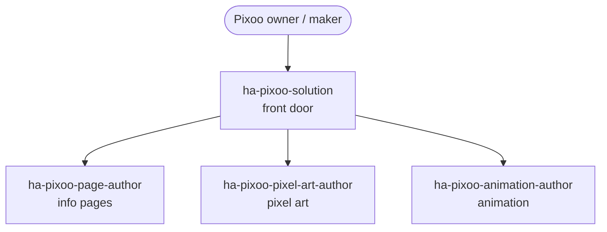

# Ein Divoom-Pixoo-Display bespielen

Verwandle eine Anforderung in ein passendes Display auf der 64×64-LED-Matrix des Divoom Pixoo 64 — Info-Seiten, die Home-Assistant-Zustand sichtbar machen, handgemachte Pixel-Art und Farbanimation.

## Anwendungsfälle

- Du willst eine **Ambient-Status-Seite**: die aktuelle Temperatur, den nächsten Kalendertermin oder den Strompreis als Text und Icons auf dem 64×64-Raster, aktualisiert aus dem Home-Assistant-Zustand.
- Du willst eine **Seite aus Komponenten zusammensetzen** — eine Uhr, ein Wetter-Glyph, einen Fortschrittsbalken — oder auf eine Special- oder Native-Page zurückgreifen, die die Pixoo-Firmware schon mitbringt, statt jeden Pixel von Hand zu setzen.
- Du willst ein Stück **detaillierte Pixel-Art**: ein Maskottchen, ein saisonales Motiv oder ein Geräte-Icon mit Schattierung und sauberen Konturen, das bei 64×64 erkennbar bleibt und nicht wie Rauschen wirkt.
- Du willst, dass sich das Display **bewegt**: eine Loop-Animation, einen Farbübergang oder eine kurze Bewegungssequenz, die abspielt, wenn eine Automation auslöst.
- Du hast die Grafiken und Seiten und willst sie nun **aus Deinem Setup ansteuern**, sodass der Pixoo Seiten nach Zeitplan oder als Reaktion auf Ereignisse wechselt.

## Zielgruppen

- **Divoom-Pixoo-64-Besitzer.** Du hast das Gerät auf dem Schreibtisch oder an der Wand und willst, dass es etwas Nützliches aus Home Assistant zeigt statt der Standardinhalte der Divoom-App. Dieser Anwendungsfall macht aus „zeig mir das Wetter und den nächsten Termin“ eine fertig ausgelegte Seite.
- **Maker, die Ambient- oder Status-Displays bauen.** Du bindest den Pixoo in ein größeres Setup ein und willst verlässliche Info-Seiten, die Du aus Automationen auslösen kannst. Du bekommst eine Seiten-Erstellung, die HA-Zustand auf das Raster abbildet — bereit, aus Deiner Automations-Ebene angesteuert zu werden.
- **Pixel-Art- und Animations-Hobbyisten.** Dir ist wichtig, wie das Bild bei 64×64 aussieht — Schattierung, Konturen und Bewegung. `ha-pixoo-pixel-art-author` und `ha-pixoo-animation-author` konzentrieren sich auf das Handwerk des Bildes und seiner Bewegung, nicht auf die Verkabelung.

## Zusammenspiel von Skills und Agents

Die Front-Door `ha-pixoo-solution` plant die Arbeit und verteilt sie an fokussierte Autoren; jeder fokussierte Skill besitzt eine Art Artefakt — eine Info-Seite, ein Stück Pixel-Art oder eine Animation.

Beschreibe, was das Display zeigen soll, und `ha-pixoo-solution` entscheidet, ob Du eine Info-Seite, Pixel-Art, Animation oder eine Kombination brauchst, und verteilt an den passenden Autor. `ha-pixoo-page-author` baut Info-Seiten aus Komponenten, Special-Pages und Native-Pages; `ha-pixoo-pixel-art-author` gestaltet detaillierte Pixel-Art mit Schattierung und Konturen; `ha-pixoo-animation-author` fügt Bewegung und Farbanimation hinzu. Sobald das Display existiert, ist die natürliche Übergabe zu [Automationen und Blueprints erstellen](automations-blueprints.md), um es anzusteuern — Seitenwechsel nach Zeitplan oder als Reaktion auf Ereignisse.

## Eingesetzte Skills und Agents

- **Front-Door:** `ha-pixoo-solution`
- **Bausteine:** `ha-pixoo-page-author` (Info-Seiten: Komponenten / Special-Pages / Native-Pages), `ha-pixoo-pixel-art-author` (detaillierte Pixel-Art mit Schattierung und Konturen), `ha-pixoo-animation-author` (Bewegung und Farbanimation)
- **Verwandte Anwendungsfälle:** [Automationen und Blueprints erstellen](automations-blueprints.md)

Den vollständigen Katalog findest Du unter [Skills](../skills/index.md) und [Agents](../agents/index.md).

## Specs

- `spec/ha/divoom-pixoo`
- `spec/ha/pixoo-pixel-art`
- `spec/ha/pixoo-pixel-art-animation`
