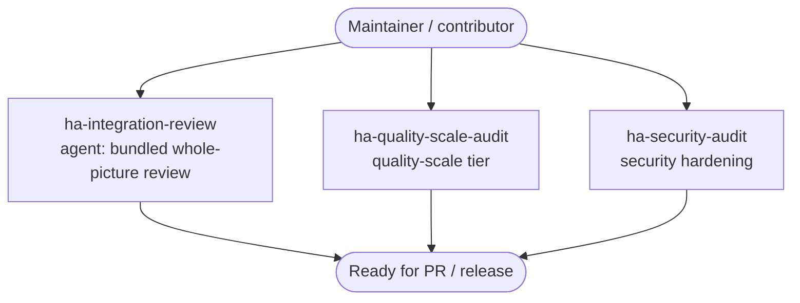

# Review und Härtung vor dem Release

Prüfe eine Integration gegen die Qualitäts- und Sicherheitsstandards von Home Assistant, bevor Du einen PR öffnest oder ein Release schneidest — eine Bewertung der Quality-Scale-Stufe, ein Durchlauf zur Security-Härtung und ein gebündeltes Gesamt-Review.

## Anwendungsfälle

- Du willst gleich einen **Pull Request** öffnen und vorher ein Gesamt-Review: Quality-Scale-Lücken, Sicherheitsprobleme und übergreifende Schwachstellen in einem Durchlauf sichtbar gemacht, damit Reviewer einen sauberen Diff sehen.
- Du **zielst auf eine Quality-Scale-Stufe** (bronze, silver, gold, platinum) und willst genau wissen, welche Anforderungen Du bereits erfüllst und welche noch fehlen, bevor Du die Stufe in der `manifest.json` beanspruchst.
- Du willst einen fokussierten Durchlauf zur **Security-Härtung**: Umgang mit Zugangsdaten, Redaction in Diagnostics, ungeprüfte Eingaben, unsicheres HTTP und Secrets, die niemals in Logs oder Config-Entry-Daten landen dürfen.
- Du schneidest ein **Release** und willst ein letztes Gate — die letzte Prüfung zwischen einem funktionierenden Build und einer veröffentlichten Komponente — statt eine Qualitäts- oder Sicherheitsregression erst zu entdecken, wenn Nutzer sie bereits installiert haben.
- Du hast ein **Custom-Panel oder eine Card** gebaut und willst dessen UX gegen die Frontend-Konventionen von Home Assistant prüfen lassen, bevor es ausgeliefert wird.

## Zielgruppen

- **Maintainer, die einen PR oder ein Release vorbereiten.** Du willst ein gebündeltes Review, das Quality-Scale-, Sicherheits- und übergreifende Probleme gemeinsam aufspürt, damit Du sie behebst, bevor Reviewer oder Nutzer es tun. Der Agent `ha-integration-review` liefert Dir diesen Gesamtdurchlauf.
- **Contributor, die auf eine Quality-Scale-Stufe zielen.** Du steigst von einer Stufe zur nächsten und brauchst eine präzise, anforderungsweise Bewertung Deines Stands. `ha-quality-scale-audit` bildet Deine Integration auf die Regeln der Stufe ab und benennt die Lücken.
- **Sicherheitsbewusste Entwickler, die vor der Veröffentlichung härten.** Du verarbeitest Zugangsdaten, Tokens oder personenbezogene Daten und willst die Angriffsfläche prüfen lassen, bevor sie zu HACS gelangt. `ha-security-audit` fokussiert auf Redaction, Eingabevalidierung und den Umgang mit Secrets.

## Zusammenspiel von Skills und Agents

Dieser Anwendungsfall hat keine `*-solution`-Front-Door: Du führst die fokussierten Audit-Skills direkt aus oder rufst den Review-Agenten für einen gebündelten Gesamtdurchlauf auf — jeder besitzt weiterhin sein eigenes Artefakt und seine Spec-Konformität.

Wähle die Tiefe, die Du brauchst: `ha-quality-scale-audit` bewertet die Quality-Scale-Stufe, `ha-security-audit` führt den Security-Härtungsdurchlauf aus, und der Agent `ha-integration-review` bündelt beides plus übergreifende Prüfungen zu einem einzigen Gesamt-Review. Alle drei Wege münden in einen Build, der bereit für einen PR oder ein Release ist. Das ist das natürliche Gate nach [Eine Custom Integration bauen (Python)](custom-integration.md) und [Auf einer Dev-HA ausführen und testen](dev-testing.md).

## Eingesetzte Skills und Agents

- **Bausteine:** `ha-quality-scale-audit` (Bewertung der Quality-Scale-Stufe), `ha-security-audit` (Security-Härtung) und der Agent `ha-integration-review` (gebündeltes Gesamt-Review, das Quality-Scale, Sicherheit und übergreifende Prüfungen kombiniert); für Frontend-Arbeit deckt `ha-panel-ux-audit` die Panel-UX ab
- **Verwandte Anwendungsfälle:** [Eine Custom Integration bauen (Python)](custom-integration.md), [Auf einer Dev-HA ausführen und testen](dev-testing.md)

Den vollständigen Katalog findest Du unter [Skills](../skills/index.md) und [Agents](../agents/index.md).

## Specs

- `spec/ha/quality-scale`
- `spec/ha/security-hardening`
