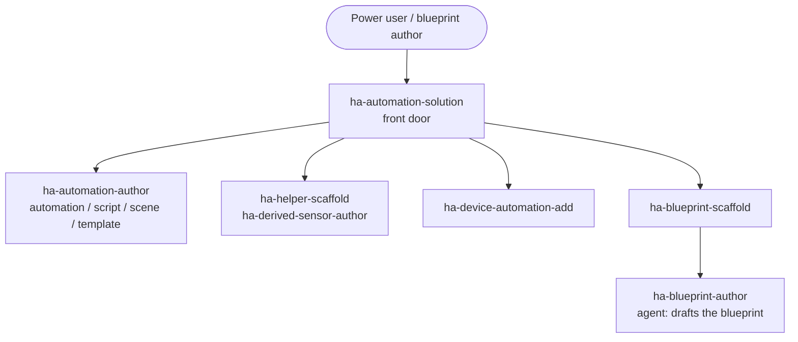

# Author automations and blueprints (YAML)

Automation logic and shareable blueprints for Home Assistant — from a single automation that reacts to one trigger to a packaged, reusable blueprint that others install and configure through the UI.

## Use cases

- You want to write an **automation** in YAML: a trigger, some conditions, and a sequence of actions — a motion light with a timeout, a notification when a door stays open, a nightly routine that arms the alarm and dims the lights.
- You want reusable **scripts, scenes, or template entities** — a script you call from several automations, a "movie night" scene, or a template sensor/binary sensor that derives its state from other entities.
- You need a **stateful helper** to hold a value the automation reads or writes: an `input_boolean` flag, an `input_number` threshold, a `timer`, a `counter`, or an `input_datetime`.
- You want a **derived or statistical sensor**: a value computed from other sensors, a `min`/`max`/`mean` over a group, or a long-run statistic (energy total, daily average) rather than a raw reading.
- You want to package a working automation as a **shareable blueprint** — inputs, selectors, and sensible defaults — so other people can import it and configure it from the UI without touching YAML.

## Target audiences

- **Power users writing automation logic in YAML.** You are comfortable in the editor and want the trigger/condition/action structure, `choose`/`if-then` branching, and templating done idiomatically instead of copied from forum posts. This use case gives you the automation, script, scene, and template artifacts, wired to the right triggers and conditions.
- **Blueprint authors packaging reusable automations.** You have an automation that works and want to hand it to others as a blueprint with typed inputs and selectors. `ha-blueprint-scaffold` sets up the structure and hands the draft to the `ha-blueprint-author` agent for the input and selector design.
- **Users building derived sensors and helpers.** You want a computed value or a stateful flag to build automations around — a threshold, a timer, a template binary sensor, or a statistical aggregate. `ha-helper-scaffold` and `ha-derived-sensor-author` produce these as first-class, well-formed artifacts.

## How skills and agents work together

The `ha-automation-solution` front door plans the work and dispatches focused skills and agents; each focused skill owns one artifact and its own spec conformance.

Describe the automation you want and `ha-automation-solution` decomposes it into the artifacts it needs, then dispatches each. `ha-automation-author` writes the automation, script, scene, or template entity; `ha-helper-scaffold` and `ha-derived-sensor-author` add the helpers and derived sensors it reads; `ha-device-automation-add` wires device-level triggers and actions.

When the goal is a shareable blueprint, `ha-blueprint-scaffold` sets up the structure and hands the draft to the `ha-blueprint-author` agent. When an automation needs a service or entity that no integration provides, the natural hand-off is to [Build a custom integration (Python)](custom-integration.md).

## Skills and agents in play

- **Front door:** `ha-automation-solution`
- **Building blocks:** `ha-automation-author` (automation / script / scene / template entity / command artifacts), `ha-helper-scaffold` (stateful helpers), `ha-derived-sensor-author` (derived / statistical sensors), `ha-device-automation-add` (device automations), `ha-blueprint-scaffold` (hands the draft to the `ha-blueprint-author` agent)
- **Related use cases:** [Build a custom integration (Python)](custom-integration.md)

See the full catalog under [Skills](../skills/index.md) and [Agents](../agents/index.md).

## Specs

- `spec/ha-automation/*` (usage corpus)
- `spec/ha/blueprint-patterns`
