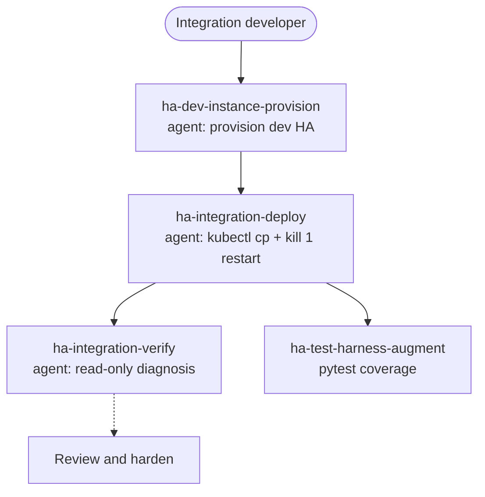

# Run and test on a dev HA

Deploy, inspect, and test an integration on a disposable Home Assistant instance running in a local Kubernetes (Kind) cluster — kept separate from production, so a broken build never touches your real setup.

## Use cases

- You just scaffolded an integration and want to **see it load in a real Home Assistant** before writing another line: provision a throwaway HA in Kind, deploy your `custom_components/<domain>/` into it, and watch the config flow appear.
- You changed a coordinator or entity and want a **fast edit-deploy-check loop**: push the new files into the running pod with `kubectl cp`, restart HA in place with `kill 1` (never delete the pod), and read the startup log — all without rebuilding an image.
- Something misbehaves and you need a **read-only diagnosis**: inspect the pod's logs, entity states, and config-entry status to find out why setup failed or an entity went unavailable, without mutating the instance.
- You are **validating a build before opening a PR** and want a clean-room instance that matches a known HA version, so "works on my machine" means "works on a disposable HA nobody else touched".
- You want **pytest coverage for the secondary code paths** — reauth, error handling, coordinator refresh failures — that a manual click-through in the UI never reaches.

## Target audiences

- **Integration developers who want a disposable HA to iterate against.** You don't want to risk your production instance or hand-manage a local HA install. This use case gives you a provision-and-tear-down dev HA in Kind and an in-place deploy loop that survives dozens of iterations a day.
- **Contributors validating a build before a PR.** You need to prove the integration actually loads and behaves on a clean, known HA version. The provision and deploy agents give you that clean-room instance; the verify agent confirms it came up correctly.
- **Developers running pytest coverage locally.** You want the secondary code paths covered by tests, not just the happy path you clicked through. `ha-test-harness-augment` extends the pytest harness to reach those branches.

## How skills and agents work together

This use case has no `*-solution` front door — it is a small cluster of agents plus one skill, chained provision → deploy → verify, with a parallel test-coverage step.

`ha-dev-instance-provision` stands up (or tears down) the disposable HA in Kind; `ha-integration-deploy` rolls your integration into the running pod with `kubectl cp` and an in-place `kill 1` restart — never deleting the pod; `ha-integration-verify` then does a read-only diagnosis of logs, states, and config-entry status. In parallel, `ha-test-harness-augment` grows the pytest harness to cover the branches the UI can't reach. What you deploy here comes from [Build a custom integration (Python)](custom-integration.md); once it runs clean, the natural next gate is [Review and harden before release](review-hardening.md).

## Skills and agents in play

- **Building blocks:** `ha-dev-instance-provision` (agent: provision / tear down a dev HA), `ha-integration-deploy` (agent: roll out via `kubectl cp`, `kill 1` restart — never delete the pod), `ha-integration-verify` (agent: read-only pod diagnosis); `ha-test-harness-augment` (skill: pytest coverage for secondary code paths)
- **Related use cases:** [Build a custom integration (Python)](custom-integration.md), [Review and harden before release](review-hardening.md)

See the full catalog under [Skills](../skills/index.md) and [Agents](../agents/index.md).

## Specs

- `spec/ha/dev-environment`
- `spec/ha/dev-instance-provisioning`
- `spec/ha/test-harness`
