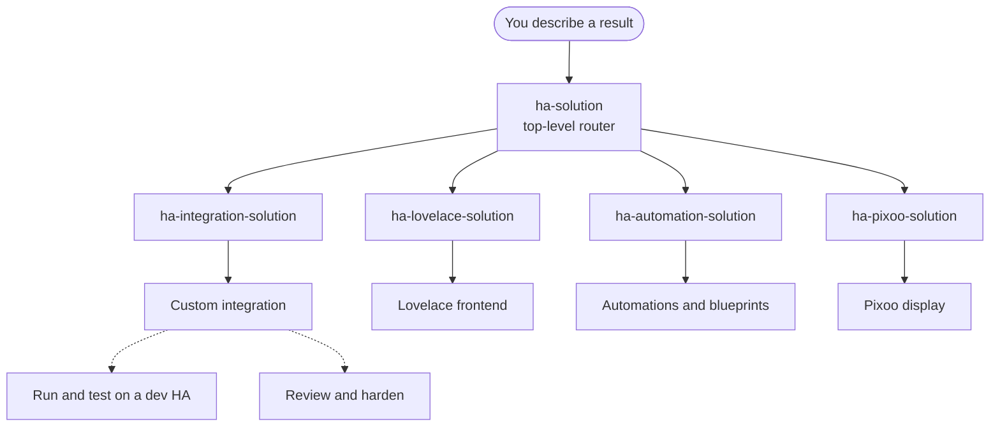

# Use cases

This plugin organizes skills, agents, and specs around six use cases. Each **domain** case has a **front-door skill** (`*-solution`) — the entry point that turns the result you want into the minimal set of artifacts and dispatches the focused skills. You don't have to know which skill produces which artifact.

Above the domain front doors sits **`ha-solution`**, the top-level router. Describe any Home Assistant result and it classifies the request into one or more domains and routes each part to the owning `*-solution`.

For genuinely cross-domain work — a custom card plus its backing integration plus an automation — it decomposes across them in dependency order and threads the shared identities (domain, entity IDs, card tags, command types) across the boundaries. Reach for a single domain front door directly when you already know the request lives in one domain.

!!! info "Front-door vs. focused skills"
    The `*-solution` skills **generate nothing themselves** — they plan (with an approval gate) and dispatch. The focused skills each own one artifact and their own spec conformance. You can also use a focused skill directly when the need is unambiguous.

## The six use cases

- [Build a custom integration (Python)](custom-integration.md) — a complete integration under `custom_components/<domain>/`, installable through HACS, from skeleton to advanced platform features.
- [Build a Lovelace frontend (TypeScript / JavaScript)](lovelace-frontend.md) — custom cards, editors, features, panels, and the Python backends that feed them.
- [Author automations and blueprints (YAML)](automations-blueprints.md) — automation logic, helpers, derived sensors, and shareable blueprints.
- [Drive a Divoom Pixoo display](pixoo-display.md) — info pages, pixel art, and animation on the Pixoo 64's 64×64 LED matrix.
- [Run and test on a dev HA](dev-testing.md) — deploy, inspect, and test on a disposable HA in a local Kubernetes (Kind) cluster.
- [Review and harden before release](review-hardening.md) — quality-scale and security checks before a PR or release.

Find the full, auto-generated catalog — with a description of every skill and agent — under [Skills](../skills/index.md) and [Agents](../agents/index.md).

## How it fits together

- **Skills and agents** are the executing building blocks — skills run interactively in the conversation, agents autonomously with a structured report.
- **Specs** under `spec/` are the source of truth: `spec/ha/*` for HA-internal contracts (verified against the official HA docs), `spec/claude/*` for the skills and agents themselves. Every skill and agent is bound to its spec.
- **`*-solution` front doors** are the recommended entry point per domain use case when more than one artifact is needed.

## Not covered yet

ESPHome custom components and Home Assistant add-ons (Docker / the s6 init system) are intended use cases, but the plugin ships **no** skills for them yet. The tagline's mention of ESPHome / add-ons describes the roadmap, not the current state.
