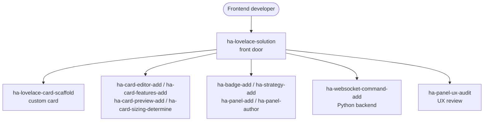

# Build a Lovelace frontend (TypeScript / JavaScript)

A custom frontend for Home Assistant dashboards — cards, visual editors, tile features, badges, dashboard strategies, and full-page panels, together with the Python WebSocket backends that feed them data.

## Use cases

- You want to build a **custom Lovelace card** — a `LitElement` web component registered as a custom element, rendering entity state the way the built-in cards don't.
- You want to give a card a **visual configuration editor** so users can wire it up in the dashboard UI instead of hand-editing YAML, plus a **preview** and correctly sized cards in the masonry grid.
- You want to add **tile features** to a card, a **badge** for compact status, or a **dashboard strategy** that generates views and cards programmatically from the entity registry.
- You want a **custom panel** — a full-page frontend at its own sidebar route — authored, given a config view, and reviewed for UX.
- You want to pair a card or panel with a **Python WebSocket backend**: a registered `websocket_api` command that streams or serves the data the frontend subscribes to.

## Target audiences

- **TypeScript / JavaScript frontend developers** building bespoke Lovelace cards as web components and wanting the scaffold, editor, features, and sizing handled to HA's contracts.
- **Dashboard builders** who have outgrown the built-in cards and want custom cards, badges, strategies, and panels tailored to their setup.
- **Full-stack integration developers** pairing a frontend artifact with a Python WebSocket command so the card gets exactly the backend data shape it needs.

## How skills and agents work together

The `ha-lovelace-solution` front door plans the frontend and dispatches to focused skills; each focused skill owns one artifact and its own spec conformance.

The front door decides which artifacts a request needs and routes each to its owner: `ha-lovelace-card-scaffold` for the card skeleton, the editor / features / preview / sizing skills for card enrichment, the badge / strategy / panel skills for the other frontend surfaces, and `ha-websocket-command-add` when a Python backend must feed the frontend. When a card needs data an integration doesn't yet expose, the natural hand-off is to [Build a custom integration](custom-integration.md); `ha-panel-ux-audit` is the panel-UX gate carried into [Review and harden before release](review-hardening.md).

## Skills and agents in play

- **Front door:** `ha-lovelace-solution`
- **Building blocks:** `ha-lovelace-card-scaffold`, `ha-card-editor-add`, `ha-card-features-add`, `ha-card-preview-add`, `ha-card-sizing-determine`, `ha-badge-add`, `ha-strategy-add`, `ha-panel-add`, `ha-panel-author`, `ha-panel-config-view-add`, `ha-panel-ux-audit`, `ha-websocket-command-add`
- **Related use cases:** [Build a custom integration](custom-integration.md) (a card often needs a backing integration), [Review and harden before release](review-hardening.md) (`ha-panel-ux-audit`)

See the full catalog under [Skills](../skills/index.md) and [Agents](../agents/index.md).

## Specs

- `spec/ha/lovelace-card-patterns`
- `spec/ha/lovelace-card-editor`
- `spec/ha/lovelace-card-features`
- `spec/ha/lovelace-badges`
- `spec/ha/lovelace-strategies`
- `spec/ha/lovelace-views-panels`
- `spec/ha/frontend-websocket-commands`
