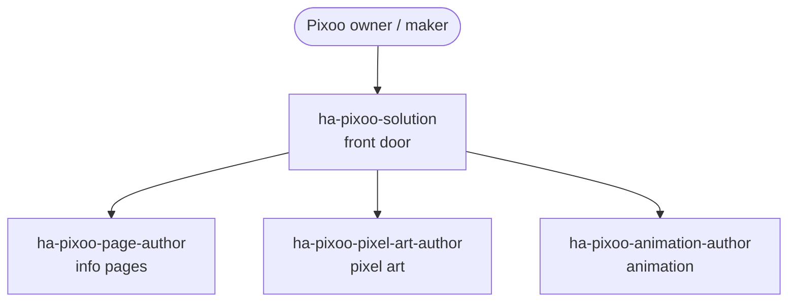

# Drive a Divoom Pixoo display

Turn a requirement into a suitable display on the Divoom Pixoo 64's 64×64 LED matrix — info pages that surface Home Assistant state, hand-crafted pixel art, and color animation.

## Use cases

- You want an **ambient status page**: the current temperature, next calendar event, or energy price laid out as text and icons on the 64×64 grid, refreshed from Home Assistant state.
- You want to **compose a page from components** — a clock, a weather glyph, a progress bar — or reach for a special or native page the Pixoo firmware already provides, instead of hand-placing every pixel.
- You want a piece of **detailed pixel art**: a mascot, a seasonal motif, or a device icon rendered with shading and clean contours so it reads at 64×64 rather than looking like noise.
- You want the display to **move**: a looping animation, a color transition, or a short motion sequence that plays when an automation fires.
- You have the artwork and pages and now want them **driven from your setup**, so the Pixoo switches pages on schedule or in response to events.

## Target audiences

- **Divoom Pixoo 64 owners.** You have the device on your desk or wall and want it to show something useful from Home Assistant rather than the stock Divoom app content. This use case turns "show me the weather and the next meeting" into a laid-out page.
- **Makers building ambient or status displays.** You are wiring the Pixoo into a wider setup and want reliable info pages you can trigger from automations. You get page authoring that maps HA state to the grid, ready to be driven from your automation layer.
- **Pixel-art and animation hobbyists.** You care about how the image looks at 64×64 — shading, contours, and motion. `ha-pixoo-pixel-art-author` and `ha-pixoo-animation-author` focus on the craft of the image and its movement, not the plumbing.

## How skills and agents work together

The `ha-pixoo-solution` front door plans the work and dispatches focused authors; each focused skill owns one kind of artifact — an info page, a piece of pixel art, or an animation.

Describe what the display should show and `ha-pixoo-solution` decides whether you need an info page, pixel art, animation, or a combination, then dispatches the matching author. `ha-pixoo-page-author` builds info pages from components, special pages, and native pages; `ha-pixoo-pixel-art-author` crafts detailed pixel art with shading and contours; `ha-pixoo-animation-author` adds motion and color animation. Once the display exists, the natural hand-off is to [Author automations and blueprints](automations-blueprints.md) to drive it — switching pages on schedule or in response to events.

## Skills and agents in play

- **Front door:** `ha-pixoo-solution`
- **Building blocks:** `ha-pixoo-page-author` (info pages: components / special pages / native pages), `ha-pixoo-pixel-art-author` (detailed pixel art with shading and contours), `ha-pixoo-animation-author` (motion and color animation)
- **Related use cases:** [Author automations and blueprints](automations-blueprints.md)

See the full catalog under [Skills](../skills/index.md) and [Agents](../agents/index.md).

## Specs

- `spec/ha/divoom-pixoo`
- `spec/ha/pixoo-pixel-art`
- `spec/ha/pixoo-pixel-art-animation`
