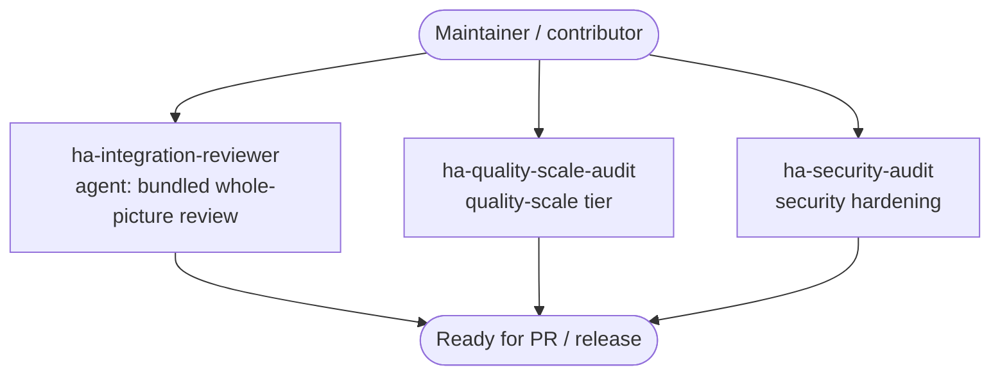

# Review and harden before release

Check an integration against Home Assistant's quality and security standards before you open a PR or cut a release — a quality-scale tier assessment, a security-hardening pass, and a bundled whole-picture review.

## Use cases

- You are about to open a **pull request** and want a whole-picture review first: quality-scale gaps, security issues, and cross-cutting problems surfaced in one pass so reviewers see a clean diff.
- You are **targeting a quality-scale tier** (bronze, silver, gold, platinum) and need to know exactly which requirements you already meet and which are still missing before you claim the tier in `manifest.json`.
- You want a focused **security-hardening pass**: credential handling, diagnostics redaction, unvalidated input, unsafe HTTP, and secrets that must never reach logs or config-entry data.
- You are cutting a **release** and want a final gate — the last check between a working build and a published component — rather than discovering a quality or security regression after users have installed it.
- You built a **custom panel or card** and need its UX reviewed against Home Assistant frontend conventions before it ships.

## Target audiences

- **Maintainers preparing a PR or release.** You want one bundled review that catches quality-scale, security, and cross-cutting issues together, so you fix them before reviewers or users do. The `ha-integration-reviewer` agent gives you that whole-picture pass.
- **Contributors targeting a quality-scale tier.** You are climbing from one tier to the next and need a precise, requirement-by-requirement assessment of where you stand. `ha-quality-scale-audit` maps your integration against the tier's rules and names the gaps.
- **Security-conscious developers hardening before publishing.** You handle credentials, tokens, or personal data and want the exposure surface checked before it reaches HACS. `ha-security-audit` focuses on redaction, input validation, and secret handling.

## How skills and agents work together

This use case has no `*-solution` front door: you run the focused audit skills directly, or invoke the review agent for a bundled whole-picture pass — each still owns its own artifact and spec conformance.

Pick the depth you need: `ha-quality-scale-audit` assesses the quality-scale tier, `ha-security-audit` runs the security-hardening pass, and the `ha-integration-reviewer` agent bundles both plus cross-cutting checks into a single whole-picture review. All three paths converge on a build that is ready for a PR or release. This is the natural gate after [Build a custom integration (Python)](custom-integration.md) and [Run and test on a dev HA](dev-testing.md).

## Skills and agents in play

- **Building blocks:** `ha-quality-scale-audit` (quality-scale tier assessment), `ha-security-audit` (security hardening), and the agent `ha-integration-reviewer` (bundled whole-picture review combining quality-scale, security, and cross-cutting checks); for frontend work, `ha-panel-ux-audit` covers panel UX
- **Related use cases:** [Build a custom integration (Python)](custom-integration.md), [Run and test on a dev HA](dev-testing.md)

See the full catalog under [Skills](../skills/index.md) and [Agents](../agents/index.md).

## Specs

- `spec/ha/quality-scale`
- `spec/ha/security-hardening`
